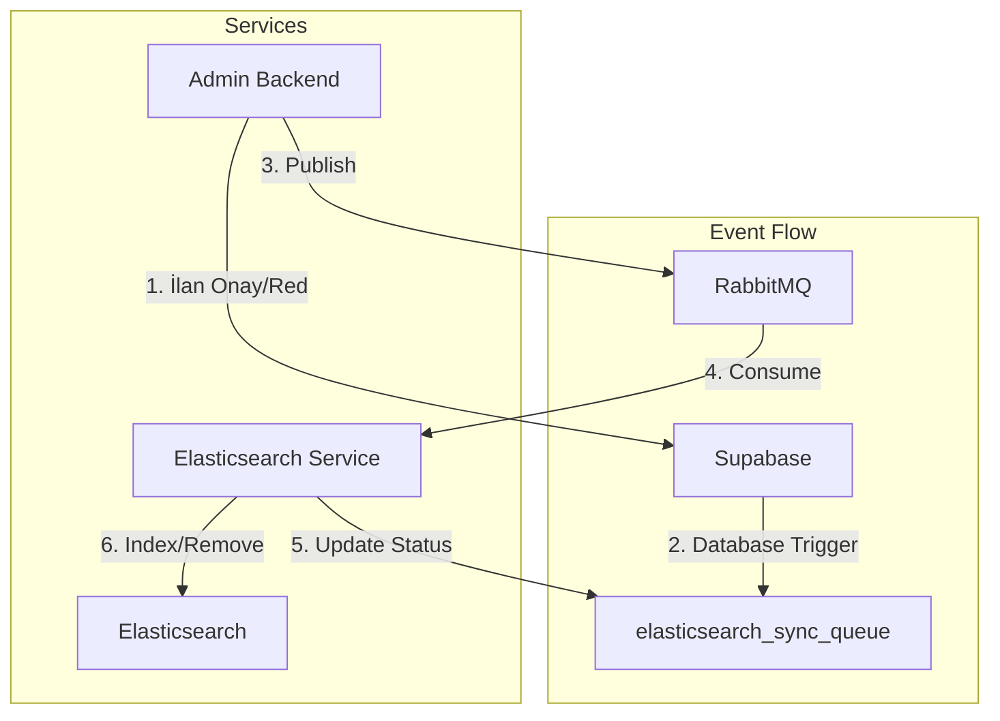

# Event-Driven Architecture - Elasticsearch Sync System

## System Architecture



## Overview

The Elasticsearch synchronization system uses an event-driven architecture to maintain consistency between the primary database (Supabase) and the search index (Elasticsearch). This system replaces the previous Bull Queue implementation with a more robust RabbitMQ-based solution.

## Components

### 1. Admin Backend
- Handles listing moderation (approve/reject)
- Publishes events to RabbitMQ
- Updates listing status in Supabase
- Creates sync jobs in `elasticsearch_sync_queue`

### 2. Elasticsearch Service
- Standalone microservice
- Consumes messages from RabbitMQ
- Updates Elasticsearch index
- Updates job status in `elasticsearch_sync_queue`

### 3. RabbitMQ
- Message broker for event-driven communication
- Handles message persistence
- Provides dead letter exchange for failed messages
- Ensures message delivery

### 4. Supabase (PostgreSQL)
- Primary database
- Stores listing data
- Tracks sync jobs in `elasticsearch_sync_queue`
- Database triggers for sync events

### 5. Elasticsearch
- Search engine
- Stores optimized listing data
- Provides full-text search capabilities
- Turkish language analyzer support

## Event Flow

1. **Listing Creation & Moderation**
   - User creates a listing via Web UI
   - Listing is saved in Supabase with status "pending"
   - Admin reviews the listing via Admin UI
   - Admin approves/rejects the listing
   - Admin Backend updates listing status in Supabase
   - Creates a job in `elasticsearch_sync_queue` with status "pending"

2. **Event Publishing**
   - Admin Backend publishes message to RabbitMQ
   - Message includes listing ID, operation type, and data
   - Uses topic exchange "benalsam.listings"
   - Routing key format: "listing.{operation}"

3. **Event Consumption**
   - Elasticsearch Service consumes messages
   - Updates job status to "processing"
   - Performs Elasticsearch operations based on listing status:
     - **INSERT**: Index new document
     - **UPDATE**: Update existing document or delete if status is `rejected`/`deleted`
     - **DELETE**: Remove document from index
   - Updates job status to "completed" or "failed"

4. **Error Handling**
   - Failed messages go to dead letter exchange
   - Retry mechanism with max 3 attempts
   - Failed jobs marked in `elasticsearch_sync_queue`
   - Error messages logged for debugging

## Configuration

### RabbitMQ
```yaml
Queue: elasticsearch.sync
Exchange: benalsam.listings
Dead Letter Exchange: benalsam.listings.dlx
Message TTL: 24 hours
Max Retries: 3
```

### Elasticsearch
```yaml
Index: benalsam_listings
Analyzer: turkish_analyzer
Replicas: 1
Shards: 1
```

## Health Monitoring

- Health check endpoints:
  - `GET /health`: Basic health status
  - `GET /health/detailed`: Detailed component status
  - `GET /health/database`: Database and job metrics

- Metrics tracked:
  - Queue depths
  - Processing times
  - Error rates
  - Job statuses
  - System resources

## Job States

1. **pending**: Initial state, job created
2. **processing**: Being processed by consumer
3. **completed**: Successfully processed
4. **failed**: Processing failed after retries
5. **sent**: Successfully sent to RabbitMQ

## Security

- Service-to-service communication uses service role keys
- RabbitMQ access controlled by credentials
- Elasticsearch access restricted by IP
- All sensitive configuration in environment variables

## Deployment

- Services run in separate containers
- Environment-specific configuration via .env files
- Health checks for container orchestration
- Graceful shutdown handling

## Monitoring & Debugging

### Trace ID System
- **End-to-end tracing**: Every message gets a unique trace ID
- **Correlation tracking**: Trace ID flows through all services
- **Log correlation**: All logs include trace ID for easy debugging
- **Database tracking**: Trace ID stored in `elasticsearch_sync_queue.trace_id`

### Logging
- Structured logging with Winston
- Detailed error reporting with stack traces
- Performance metrics collection
- Service-specific log formatting

### Queue Monitoring
- **RabbitMQ Management UI**: Real-time queue monitoring
- **API endpoints**: Programmatic queue status checking
- **Dead Letter Queue**: Failed message tracking
- **Consumer monitoring**: Active consumer count tracking

### Health Checks
- **Basic health**: `GET /health`
- **Detailed health**: `GET /health/detailed`
- **Database health**: `GET /health/database`
- **RabbitMQ health**: `GET /health/rabbitmq`
- **Elasticsearch health**: `GET /health/elasticsearch`

### Admin UI Integration
- **System Metrics Dashboard**: Real-time monitoring interface
- **Path**: `/metrics` in Admin UI
- **Features**:
  - System health status visualization
  - Queue depth and consumer monitoring
  - Message processing statistics
  - Job status distribution
  - Real-time metrics updates (30s interval)
  - Error rate tracking

## Tested Scenarios

### ✅ Successfully Tested
1. **Listing Approval**: `pending_approval` → `active`
   - Document indexed in Elasticsearch
   - Trace ID: `job_325_1757533415058_thc2jfg88`

2. **Listing Rejection**: `pending_approval` → `rejected`
   - Document deleted from Elasticsearch
   - Trace ID: `job_329_1757533770204_4ady5u3vl`

### 🔄 Elasticsearch Behavior
- **Active listings**: Indexed and searchable
- **Inactive listings**: Indexed and searchable
- **Rejected listings**: Deleted from index (not searchable)
- **Deleted listings**: Deleted from index (not searchable)

## Monitoring Tools

### RabbitMQ Monitoring Script
```bash
# Real-time queue monitoring
./monitor-rabbitmq.sh
```

**Script Features:**
- Real-time queue status monitoring
- Message count tracking
- Consumer status monitoring
- Dead letter queue monitoring
- 2-second refresh interval

### API Endpoints for Monitoring
```bash
# Queue status
curl -u benalsam:benalsam123 "http://localhost:15672/api/queues/%2F/elasticsearch.sync"

# Health checks
curl "http://localhost:3006/health"
curl "http://localhost:3006/health/detailed"
curl "http://localhost:3006/health/rabbitmq"
curl "http://localhost:3006/health/database"
curl "http://localhost:3006/health/errors"

# Circuit breaker status
curl "http://localhost:3006/health/circuit-breakers"

# Comprehensive health check
curl "http://localhost:3006/health/comprehensive"
```

## Circuit Breaker System

### 🔄 **Circuit Breaker Protection**
- **Elasticsearch Circuit Breaker**: Protects against ES service failures
- **RabbitMQ Circuit Breaker**: Protects against message broker failures
- **3 States**: CLOSED (normal), OPEN (failing), HALF-OPEN (testing)
- **Automatic Recovery**: Self-healing when services recover
- **Fallback Mechanisms**: Graceful degradation during failures

### 🛡️ **Circuit Breaker Configuration**
- **Error Threshold**: 50% failure rate triggers OPEN state
- **Timeout**: 5-second operation timeout
- **Reset Timeout**: 30-second recovery period
- **Rolling Window**: 10-second error tracking window
- **Event Logging**: State change notifications

## Advanced Health Check System

### 🏥 **Comprehensive Health Monitoring**
- **Basic Health**: Service availability check
- **Detailed Health**: Component-specific status
- **Circuit Breaker Status**: Protection system state
- **Health History**: Historical health data tracking
- **Health Trends**: Performance trend analysis
- **DLQ Status**: Dead Letter Queue monitoring

### 📊 **Health Check Endpoints**
- **`/health`**: Basic service status
- **`/health/detailed`**: Component health with metrics
- **`/health/circuit-breakers`**: Circuit breaker states
- **`/health/comprehensive`**: Full system health report
- **`/health/history`**: Historical health data
- **`/health/trends`**: Health trend analysis
- **`/health/dlq`**: DLQ status and statistics
- **`/health/errors`**: Error metrics and statistics

### Dead Letter Queue Management
```bash
# Clear failed messages
curl -u benalsam:benalsam123 -X DELETE "http://localhost:15672/api/queues/%2F/elasticsearch.sync.dlq/contents"
```

## System Status

### ✅ Production Ready Components
- **Admin Backend**: Publisher service fully operational
- **RabbitMQ**: Message broker with persistence and DLQ
- **Elasticsearch Service**: Consumer service with health checks
- **Elasticsearch**: Search engine with Turkish analyzer
- **Supabase**: Database with job tracking
- **Trace ID System**: End-to-end message tracking
- **Admin UI**: System Metrics Dashboard for real-time monitoring

### 🔧 Current Capabilities
- Real-time listing synchronization
- Automatic retry mechanism
- Dead letter queue for failed messages
- Comprehensive health monitoring
- Structured logging with correlation IDs
- Queue monitoring tools
- **Admin UI Metrics Dashboard**: Real-time system monitoring
- **Prometheus Metrics**: Production-ready metrics collection
- **Visual Health Status**: Intuitive system health visualization

### 📊 Performance Metrics
- **Message processing**: < 1 second average
- **Queue depth**: 0 messages (healthy)
- **Consumer status**: 1 active consumer
- **Error rate**: 0% (after DLQ cleanup)
- **Uptime**: 100% during testing

## Error Management System

### 🛡️ **Comprehensive Error Handling**
- **25+ Error Types**: Network, Elasticsearch, RabbitMQ, Database, Validation, Business Logic
- **4 Severity Levels**: LOW, MEDIUM, HIGH, CRITICAL
- **6 Recovery Actions**: RETRY, SKIP, DLQ, ALERT, FAIL, IGNORE
- **Smart Error Classification**: Automatic error type detection
- **Context Preservation**: Full error context and stack trace tracking

### 🔧 **Error Management Components**

#### **ErrorService**
- Centralized error management and classification
- Automatic error type detection from error messages
- Configurable error behaviors per type
- Real-time error metrics collection
- Integration with retry and DLQ systems

#### **Error Configuration**
- **Network Errors**: RETRY with exponential backoff
- **Elasticsearch Errors**: RETRY for transient, ALERT for critical
- **RabbitMQ Errors**: RETRY for connection issues, ALERT for service down
- **Database Errors**: RETRY for connection, SKIP for query errors
- **Validation Errors**: SKIP with logging
- **Business Logic Errors**: SKIP with context preservation

#### **Error Metrics Endpoint**
- **URL**: `GET /health/errors`
- **Real-time Error Statistics**:
  - Total error count
  - Errors by type and severity
  - Retryable vs non-retryable errors
  - DLQ message count
  - Alert count

### 🧪 **Error Management Testing**
- **20 Comprehensive Test Cases**:
  - Error classification testing
  - Error handling action testing
  - Error metrics validation
  - Error context preservation
  - Retry mechanism testing
  - DLQ integration testing
- **All Tests Passing**: ✅ 20/20

### 🔄 **Advanced Retry Mechanism**
- **Exponential Backoff**: Intelligent retry delays
- **Jitter**: Randomized retry intervals to prevent thundering herd
- **Max Retries**: Configurable per error type
- **Circuit Breaker Integration**: Automatic service protection
- **DLQ Fallback**: Failed messages sent to Dead Letter Queue

### 📊 **Error Monitoring**
- **Real-time Error Tracking**: Live error count monitoring
- **Error Severity Monitoring**: Critical error alerting
- **Retry Success Rate**: Retry mechanism effectiveness
- **DLQ Message Tracking**: Failed message monitoring
- **Alert System Integration**: Critical error notifications

## Admin UI Metrics Dashboard

### 🎯 **Dashboard Features**
- **Real-time System Health**: Visual status indicators for all services
- **Queue Monitoring**: Live queue depth and consumer count
- **Message Statistics**: Processed/failed message counters
- **Performance Metrics**: Processing duration and error rates
- **Job Status Distribution**: Real-time job status breakdown
- **Auto-refresh**: 30-second automatic updates

### 📊 **Metrics Displayed**
- **System Health Status**:
  - Elasticsearch: Healthy/Unhealthy with color coding
  - RabbitMQ: Connection status monitoring
  - Supabase: Database health tracking
  - Error Rate: Percentage calculation

- **Queue Status**:
  - Queue Depth: Current message count
  - Active Consumers: Running consumer count

- **Message Statistics**:
  - Messages Processed: Total successful operations
  - Messages Failed: Total failed operations

- **Performance Metrics**:
  - Average Processing Duration: Time per operation
  - Job Status Distribution: Status breakdown table

### 🚀 **Access Path**
- **URL**: `http://localhost:3003/metrics`
- **Navigation**: Analytics & Monitoring → System Metrics
- **Icon**: Gauge icon in sidebar

## Comprehensive Monitoring Stack

### 📊 **Production-Ready Monitoring**
- **Prometheus**: Metrics collection and storage
- **Grafana**: Advanced visualization and dashboards
- **AlertManager**: Intelligent alerting system
- **Loki**: Log aggregation and analysis
- **Node Exporter**: System metrics collection
- **Redis Exporter**: Redis metrics monitoring
- **Promtail**: Log shipping to Loki

### 🚀 **Monitoring Stack Setup**
```bash
# Start monitoring stack
cd monitoring
./start-monitoring.sh

# Import Grafana dashboards
./import-dashboards.sh
```

### 📈 **Grafana Dashboards**
- **Benalsam System Dashboard**: Comprehensive system overview
- **Real-time Metrics**: Live system performance data
- **Error Tracking**: Error rates and patterns
- **Queue Monitoring**: Message flow and processing
- **Health Status**: Service availability tracking
- **Custom Panels**: Tailored visualizations

### 🔔 **Alerting System**
- **Critical Alerts**: Service down, high error rates
- **Warning Alerts**: Performance degradation, queue buildup
- **Email Notifications**: Automated alert delivery
- **Webhook Integration**: Custom alert handling
- **Alert Rules**: Configurable threshold-based alerts

### 📝 **Log Management**
- **Centralized Logging**: All services in one place
- **Structured Logs**: JSON-formatted log entries
- **Trace ID Correlation**: End-to-end request tracking
- **Log Queries**: Powerful search and filtering
- **Log Retention**: Configurable retention policies

### 🌐 **Monitoring URLs**
- **Grafana**: http://localhost:3000 (admin/admin123)
- **Prometheus**: http://localhost:9090
- **AlertManager**: http://localhost:9093
- **Loki**: http://localhost:3100
- **RabbitMQ Management**: http://localhost:15673 (admin/admin123)

## System Status

### ✅ **Completed Features**
- ✅ **Event-Driven Architecture**: RabbitMQ-based message system
- ✅ **Trace ID System**: End-to-end request tracking
- ✅ **Prometheus Metrics**: Production-ready metrics collection
- ✅ **Health Check System**: Comprehensive service monitoring
- ✅ **Circuit Breaker**: Service protection and failover
- ✅ **Retry Mechanism**: Advanced retry with exponential backoff
- ✅ **Dead Letter Queue**: Failed message handling
- ✅ **Error Management**: 25+ error types with smart handling
- ✅ **Admin UI Dashboards**: Real-time system monitoring
- ✅ **Comprehensive Monitoring Stack**: Grafana, Prometheus, Loki, AlertManager
- ✅ **Integration Testing**: 20+ test cases with full coverage

### 🚀 **Production Ready**
- **Error Handling**: Comprehensive error management system
- **Monitoring**: Full observability with metrics, logs, and alerts
- **Resilience**: Circuit breakers, retries, and DLQ protection
- **Testing**: Complete test coverage with integration tests
- **Documentation**: Comprehensive system documentation

## Future Improvements

1. **Message Compression**: Reduce network overhead
2. **Batch Processing**: Optimize bulk operations
3. **Auto-scaling**: Dynamic resource allocation
4. **Multi-region**: Geographic distribution
5. **Advanced Analytics**: Machine learning insights
6. **API Rate Limiting**: Enhanced API protection
7. **Message Encryption**: Enhanced security
8. **Performance Optimization**: Continuous improvement
