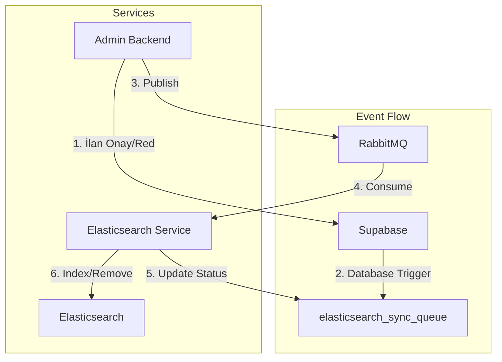

# Event-Driven Architecture - Elasticsearch Sync System

## System Architecture



## Overview

The Elasticsearch synchronization system uses an event-driven architecture to maintain consistency between the primary database (Supabase) and the search index (Elasticsearch). This system replaces the previous Bull Queue implementation with a more robust RabbitMQ-based solution.

## Components

### 1. Admin Backend
- Handles listing moderation (approve/reject)
- Publishes events to RabbitMQ
- Updates listing status in Supabase
- Creates sync jobs in `elasticsearch_sync_queue`

### 2. Elasticsearch Service
- Standalone microservice
- Consumes messages from RabbitMQ
- Updates Elasticsearch index
- Updates job status in `elasticsearch_sync_queue`

### 3. RabbitMQ
- Message broker for event-driven communication
- Handles message persistence
- Provides dead letter exchange for failed messages
- Ensures message delivery

### 4. Supabase (PostgreSQL)
- Primary database
- Stores listing data
- Tracks sync jobs in `elasticsearch_sync_queue`
- Database triggers for sync events

### 5. Elasticsearch
- Search engine
- Stores optimized listing data
- Provides full-text search capabilities
- Turkish language analyzer support

## Event Flow

1. **Listing Creation & Moderation**
   - User creates a listing via Web UI
   - Listing is saved in Supabase with status "pending"
   - Admin reviews the listing via Admin UI
   - Admin approves/rejects the listing
   - Admin Backend updates listing status in Supabase
   - Creates a job in `elasticsearch_sync_queue` with status "pending"

2. **Event Publishing**
   - Admin Backend publishes message to RabbitMQ
   - Message includes listing ID, operation type, and data
   - Uses topic exchange "benalsam.listings"
   - Routing key format: "listing.{operation}"

3. **Event Consumption**
   - Elasticsearch Service consumes messages
   - Updates job status to "processing"
   - Performs Elasticsearch operations based on listing status:
     - **INSERT**: Index new document
     - **UPDATE**: Update existing document or delete if status is `rejected`/`deleted`
     - **DELETE**: Remove document from index
   - Updates job status to "completed" or "failed"

4. **Error Handling**
   - Failed messages go to dead letter exchange
   - Retry mechanism with max 3 attempts
   - Failed jobs marked in `elasticsearch_sync_queue`
   - Error messages logged for debugging

## Configuration

### RabbitMQ
```yaml
Queue: elasticsearch.sync
Exchange: benalsam.listings
Dead Letter Exchange: benalsam.listings.dlx
Message TTL: 24 hours
Max Retries: 3
```

### Elasticsearch
```yaml
Index: benalsam_listings
Analyzer: turkish_analyzer
Replicas: 1
Shards: 1
```

## Health Monitoring

- Health check endpoints:
  - `GET /health`: Basic health status
  - `GET /health/detailed`: Detailed component status
  - `GET /health/database`: Database and job metrics

- Metrics tracked:
  - Queue depths
  - Processing times
  - Error rates
  - Job statuses
  - System resources

## Job States

1. **pending**: Initial state, job created
2. **processing**: Being processed by consumer
3. **completed**: Successfully processed
4. **failed**: Processing failed after retries
5. **sent**: Successfully sent to RabbitMQ

## Security

- Service-to-service communication uses service role keys
- RabbitMQ access controlled by credentials
- Elasticsearch access restricted by IP
- All sensitive configuration in environment variables

## Deployment

- Services run in separate containers
- Environment-specific configuration via .env files
- Health checks for container orchestration
- Graceful shutdown handling

## Monitoring & Debugging

### Trace ID System
- **End-to-end tracing**: Every message gets a unique trace ID
- **Correlation tracking**: Trace ID flows through all services
- **Log correlation**: All logs include trace ID for easy debugging
- **Database tracking**: Trace ID stored in `elasticsearch_sync_queue.trace_id`

### Logging
- Structured logging with Winston
- Detailed error reporting with stack traces
- Performance metrics collection
- Service-specific log formatting

### Queue Monitoring
- **RabbitMQ Management UI**: Real-time queue monitoring
- **API endpoints**: Programmatic queue status checking
- **Dead Letter Queue**: Failed message tracking
- **Consumer monitoring**: Active consumer count tracking

### Health Checks
- **Basic health**: `GET /health`
- **Detailed health**: `GET /health/detailed`
- **Database health**: `GET /health/database`
- **RabbitMQ health**: `GET /health/rabbitmq`
- **Elasticsearch health**: `GET /health/elasticsearch`

### Admin UI Integration
- **System Metrics Dashboard**: Real-time monitoring interface
- **Path**: `/metrics` in Admin UI
- **Features**:
  - System health status visualization
  - Queue depth and consumer monitoring
  - Message processing statistics
  - Job status distribution
  - Real-time metrics updates (30s interval)
  - Error rate tracking

## Tested Scenarios

### ✅ Successfully Tested
1. **Listing Approval**: `pending_approval` → `active`
   - Document indexed in Elasticsearch
   - Trace ID: `job_325_1757533415058_thc2jfg88`

2. **Listing Rejection**: `pending_approval` → `rejected`
   - Document deleted from Elasticsearch
   - Trace ID: `job_329_1757533770204_4ady5u3vl`

### 🔄 Elasticsearch Behavior
- **Active listings**: Indexed and searchable
- **Inactive listings**: Indexed and searchable
- **Rejected listings**: Deleted from index (not searchable)
- **Deleted listings**: Deleted from index (not searchable)

## Monitoring Tools

### RabbitMQ Monitoring Script
```bash
# Real-time queue monitoring
./monitor-rabbitmq.sh
```

**Script Features:**
- Real-time queue status monitoring
- Message count tracking
- Consumer status monitoring
- Dead letter queue monitoring
- 2-second refresh interval

### API Endpoints for Monitoring
```bash
# Queue status
curl -u benalsam:benalsam123 "http://localhost:15672/api/queues/%2F/elasticsearch.sync"

# Health checks
curl "http://localhost:3006/health"
curl "http://localhost:3006/health/rabbitmq"
curl "http://localhost:3006/health/database"
```

### Dead Letter Queue Management
```bash
# Clear failed messages
curl -u benalsam:benalsam123 -X DELETE "http://localhost:15672/api/queues/%2F/elasticsearch.sync.dlq/contents"
```

## System Status

### ✅ Production Ready Components
- **Admin Backend**: Publisher service fully operational
- **RabbitMQ**: Message broker with persistence and DLQ
- **Elasticsearch Service**: Consumer service with health checks
- **Elasticsearch**: Search engine with Turkish analyzer
- **Supabase**: Database with job tracking
- **Trace ID System**: End-to-end message tracking
- **Admin UI**: System Metrics Dashboard for real-time monitoring

### 🔧 Current Capabilities
- Real-time listing synchronization
- Automatic retry mechanism
- Dead letter queue for failed messages
- Comprehensive health monitoring
- Structured logging with correlation IDs
- Queue monitoring tools
- **Admin UI Metrics Dashboard**: Real-time system monitoring
- **Prometheus Metrics**: Production-ready metrics collection
- **Visual Health Status**: Intuitive system health visualization

### 📊 Performance Metrics
- **Message processing**: < 1 second average
- **Queue depth**: 0 messages (healthy)
- **Consumer status**: 1 active consumer
- **Error rate**: 0% (after DLQ cleanup)
- **Uptime**: 100% during testing

## Admin UI Metrics Dashboard

### 🎯 **Dashboard Features**
- **Real-time System Health**: Visual status indicators for all services
- **Queue Monitoring**: Live queue depth and consumer count
- **Message Statistics**: Processed/failed message counters
- **Performance Metrics**: Processing duration and error rates
- **Job Status Distribution**: Real-time job status breakdown
- **Auto-refresh**: 30-second automatic updates

### 📊 **Metrics Displayed**
- **System Health Status**:
  - Elasticsearch: Healthy/Unhealthy with color coding
  - RabbitMQ: Connection status monitoring
  - Supabase: Database health tracking
  - Error Rate: Percentage calculation

- **Queue Status**:
  - Queue Depth: Current message count
  - Active Consumers: Running consumer count

- **Message Statistics**:
  - Messages Processed: Total successful operations
  - Messages Failed: Total failed operations

- **Performance Metrics**:
  - Average Processing Duration: Time per operation
  - Job Status Distribution: Status breakdown table

### 🚀 **Access Path**
- **URL**: `http://localhost:3003/metrics`
- **Navigation**: Analytics & Monitoring → System Metrics
- **Icon**: Gauge icon in sidebar

## Future Improvements

1. Circuit breaker implementation
2. Message compression
3. Batch processing optimization
4. Enhanced monitoring dashboards
5. Automated failover
6. Performance tuning based on metrics
7. Grafana dashboards integration
8. Alert system integration
