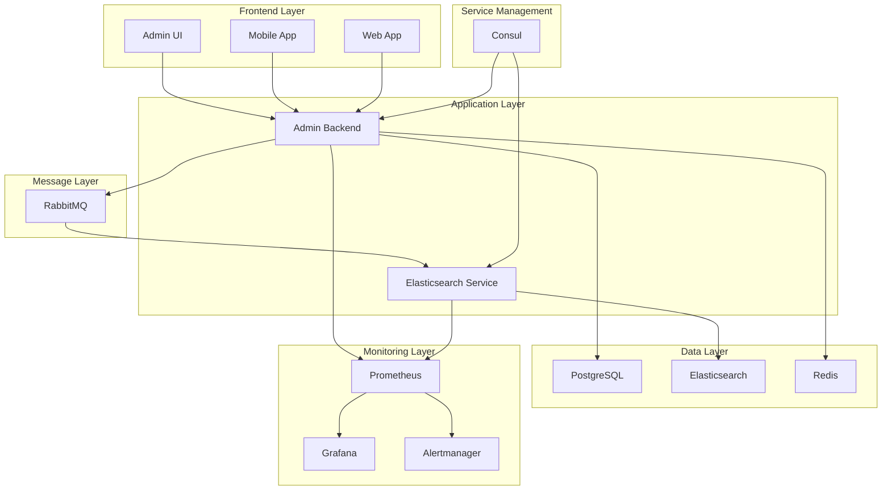

# 🏗️ BENALSAM STANDALONE - SİSTEM MİMARİSİ

## 📊 MEVCUT SİSTEM BİLEŞENLERİ

### 1. 🎯 ANA UYGULAMALAR
- **Admin Backend** (Port 3002) - İlan yönetimi, moderasyon
- **Admin UI** (Port 3003) - Web arayüzü
- **Mobile App** (Port 8081) - React Native uygulaması
- **Web App** (Port 5173) - Kullanıcı arayüzü
- **Elasticsearch Service** (Port 3006) - Arama ve sync

### 2. 🗄️ VERİTABANI VE DEPOLAMA
- **PostgreSQL** - Ana veritabanı
- **Elasticsearch** (Port 9200) - Arama index'i
- **Redis** - Cache ve session yönetimi

### 3. 🔄 MESAJLAŞMA VE KÜMELENME
- **RabbitMQ** (Port 5672, 15672) - Event-driven mesajlaşma
- **Consul** - Service discovery ve configuration

### 4. 📈 MONİTORİNG VE OBSERVABILITY
- **Prometheus** - Metrics toplama
- **Grafana** - Dashboard ve görselleştirme
- **Alertmanager** - Alert yönetimi

---

## 🔧 HER BİR ARACIN ROLÜ VE FAYDASI

### 🐰 RABBITMQ - Event-Driven Architecture

**Ne işe yarar:**
- **Asenkron İşlemler**: İlan onaylandığında hemen response döner, sync arka planda olur
- **Güvenilirlik**: Mesaj kaybolmaz, retry mekanizması var
- **Ölçeklenebilirlik**: Birden fazla consumer çalışabilir
- **Decoupling**: Servisler birbirinden bağımsız çalışır

**Örnek Senaryo:**
```
İlan Onaylama → RabbitMQ → Elasticsearch Sync → Cache Invalidation → Notification
```

**Mesaj Akışı:**
```
Admin Backend → RabbitMQ → Elasticsearch Service → Elasticsearch
```

### 📊 PROMETHEUS - Metrics Collection

**Ne işe yarar:**
- **Performance Monitoring**: Response time, throughput, error rate
- **Business Metrics**: Günlük ilan sayısı, onay oranları
- **System Health**: CPU, memory, disk kullanımı
- **Custom Metrics**: Queue depth, job processing time

**Örnek Metrikler:**
```prometheus
# İlan işlem metrikleri
listings_processed_total{status="active"}
listings_processing_duration_seconds
queue_messages_pending

# Sistem metrikleri
http_requests_total{endpoint="/api/v1/listings"}
elasticsearch_sync_duration_seconds
rabbitmq_queue_depth
```

**Veri Akışı:**
```
Application → Prometheus → Grafana
```

### 📈 GRAFANA - Dashboard ve Görselleştirme

**Ne işe yarar:**
- **Real-time Monitoring**: Canlı sistem durumu
- **Historical Analysis**: Geçmiş performans analizi
- **Business Intelligence**: İlan trendleri, kullanıcı davranışları
- **Capacity Planning**: Sistem kaynak planlaması

**Örnek Dashboard'lar:**
- **System Overview**: Tüm servislerin durumu
- **Business Metrics**: İlan istatistikleri, onay oranları
- **Performance**: Response time, error rate
- **Infrastructure**: CPU, memory, disk kullanımı

**Veri Akışı:**
```
Prometheus → Grafana → Real-time Dashboards
```

### 🚨 ALERTMANAGER - Alert Yönetimi

**Ne işe yarar:**
- **Proactive Monitoring**: Sorunları önceden tespit etme
- **Multi-channel Alerts**: Email, Slack, SMS
- **Alert Grouping**: Benzer alertleri gruplama
- **Escalation**: Kritik alertler için escalation

**Örnek Alert'ler:**
```yaml
# Yüksek error rate
- alert: HighErrorRate
  expr: rate(http_requests_total{status=~"5.."}[5m]) > 0.1
  for: 2m
  labels:
    severity: critical
  annotations:
    summary: "High error rate detected"

# Queue backup
- alert: QueueBackup
  expr: rabbitmq_queue_messages > 1000
  for: 5m
  labels:
    severity: warning
  annotations:
    summary: "Queue backup detected"
```

**Alert Akışı:**
```
Prometheus → Alert Rules → Alertmanager → Email/Slack
```

### 🏛️ CONSUL - Service Discovery ve Configuration

**Ne işe yarar:**
- **Service Discovery**: Servislerin otomatik keşfi
- **Configuration Management**: Merkezi konfigürasyon
- **Health Checks**: Servis sağlık kontrolü
- **Load Balancing**: Otomatik yük dağıtımı

**Örnek Kullanım:**
```javascript
// Servis keşfi
const elasticsearchService = consul.getService('elasticsearch-service');
const adminBackend = consul.getService('admin-backend');

// Konfigürasyon yönetimi
const config = consul.getConfig('database');
const rabbitmqConfig = consul.getConfig('rabbitmq');
```

**Servis Yönetimi:**
```
Consul → Service Registry → Health Checks → Load Balancing
```

---

## 🔄 TAM SİSTEM AKIŞI

### 1. İlan Onaylama Süreci

**Sequence Diagram:**
```
Admin UI → Admin Backend → PostgreSQL → RabbitMQ → Elasticsearch Service → Elasticsearch
```

**Detaylı Adımlar:**
1. **Admin UI**: İlan onaylama butonuna tıklanır
2. **Admin Backend**: `POST /api/v1/listings/{id}/moderate` endpoint'i çağrılır
3. **PostgreSQL**: İlan status'u `pending` → `active` olur
4. **Database Trigger**: `add_to_sync_queue()` fonksiyonu çalışır
5. **RabbitMQ**: Status change mesajı gönderilir
6. **Elasticsearch Service**: Mesajı alır ve işler
7. **Elasticsearch**: İlan index'e eklenir/güncellenir

### 2. Monitoring ve Alerting

**Monitoring Akışı:**
```
Application → Prometheus → Grafana → Real-time Monitoring
Application → Prometheus → Alertmanager → Email/Slack Alerts
```

---

## 💼 PRATİK FAYDALAR

### 👨‍💼 YÖNETİCİ İÇİN
- **Dashboard**: Günlük ilan sayısı, onay oranları, sistem sağlığı
- **Alert**: Kritik sorunlar anında bildirilir
- **Trend Analysis**: Aylık/haftalık performans analizi

### 👨‍💻 GELİŞTİRİCİ İÇİN
- **Debug**: Hangi serviste sorun var?
- **Performance**: Hangi endpoint yavaş?
- **Dependencies**: Servisler birbirini nasıl etkiliyor?

### 🔧 OPERASYON İÇİN
- **Health Checks**: Tüm servisler çalışıyor mu?
- **Capacity Planning**: Ne kadar kaynak gerekli?
- **Incident Response**: Sorun nerede, nasıl çözülür?

---

## 🚀 GELECEKTEKİ FAYDALAR

### 📈 ÖLÇEKLENEBİLİRLİK
- **Horizontal Scaling**: Servisleri çoğaltabilirsin
- **Load Balancing**: Consul ile otomatik yük dağıtımı
- **Auto-scaling**: Metrikler bazında otomatik ölçekleme

### 🔍 OBSERVABILITY
- **Distributed Tracing**: Request'lerin tüm sistemdeki yolunu takip
- **Log Aggregation**: Tüm logları merkezi toplama
- **APM**: Application Performance Monitoring

### 🛡️ GÜVENİLİRLİK
- **Circuit Breaker**: Servis çökerse sistem korunur
- **Retry Logic**: Geçici hatalar otomatik düzelir
- **Graceful Degradation**: Servis çökerse alternatif çözümler

---

## 🎯 SİSTEM MİMARİSİ DİYAGRAMI



---

## 📋 SERVİS BAŞLATMA KOMUTLARI

### Ana Servisler
```bash
# Admin Backend
cd benalsam-admin-backend && npm run dev

# Elasticsearch Service
cd benalsam-elasticsearch-service && npm run dev

# Admin UI
cd benalsam-admin-ui && npm run dev

# Web App
cd benalsam-web && npm run dev

# Mobile App
cd benalsam-mobile && npm run dev
```

### Infrastructure Servisleri
```bash
# RabbitMQ (Docker)
cd event-system && docker-compose -f docker-compose.dev.yml up -d rabbitmq

# Prometheus + Grafana + Alertmanager
cd monitoring && docker-compose up -d

# Consul
consul agent -dev -ui -client=0.0.0.0
```

---

## 🔍 MONİTORİNG ENDPOİNTLERİ

### Health Checks
```bash
# Admin Backend
curl http://localhost:3002/api/v1/health

# Elasticsearch Service
curl http://localhost:3006/health

# RabbitMQ
curl http://localhost:15672/api/overview

# Prometheus
curl http://localhost:9090/api/v1/query?query=up
```

### Metrics
```bash
# Prometheus Metrics
curl http://localhost:3002/metrics
curl http://localhost:3006/metrics

# Grafana Dashboard
http://localhost:3000
```

---

## 💡 ÖZET

Bu sistem **enterprise-grade** bir e-ticaret platformu! Her araç belirli bir amaca hizmet ediyor:

- **RabbitMQ**: Asenkron işlemler ve güvenilirlik
- **Prometheus**: Metrik toplama ve monitoring
- **Grafana**: Görselleştirme ve analiz
- **Alertmanager**: Proaktif sorun tespiti
- **Consul**: Servis yönetimi ve konfigürasyon

**Sonuç**: Ölçeklenebilir, güvenilir, izlenebilir bir sistem! 🎉

---

## 🧪 MONİTORİNG SİSTEMİ TEST SONUÇLARI

### ✅ SİSTEM DURUMU (14 Eylül 2025, 23:45)

#### Çalışan Servisler
- **Grafana**: ✅ http://localhost:3000 (Up About an hour)
- **Prometheus**: ✅ http://localhost:9090 (Up 11 minutes)
- **Alertmanager**: ✅ http://localhost:9093 (Up 13 minutes)
- **Admin Backend**: ✅ http://localhost:3002 (ts-node process)
- **Elasticsearch Service**: ✅ http://localhost:3006 (ts-node process)
- **PostgreSQL**: ✅ (Supabase - Up 12 days)

#### Metrics Endpoint'leri
- **Admin Backend Metrics**: ✅ Prometheus formatında çalışıyor
- **Elasticsearch Service Metrics**: ✅ Prometheus formatında çalışıyor
- **System Uptime**: ✅ 1720+ saniye (28+ dakika)
- **CPU Usage**: ✅ Normal seviyelerde

#### Prometheus Targets Durumu
- **admin-backend**: ✅ UP
- **admin-backend-health**: ✅ UP
- **elasticsearch-service**: ✅ UP
- **elasticsearch-service-health**: ⚠️ DOWN (JSON format sorunu)

#### Aktif Uyarılar
- **HighDiskUsage**: 🔥 FIRING (disk kullanımı yüksek)
- **LowDiskSpace**: 🔥 FIRING (disk alanı az)
- **Diğer Uyarılar**: ✅ INACTIVE (normal)

#### Alert Rules
- **benalsam-infrastructure-alerts**: ✅ 3 kural (HighCPUUsage, HighDiskUsage, LowDiskSpace)
- **benalsam-service-alerts**: ✅ 7 kural (AdminBackendDown, ElasticsearchServiceDown, vb.)
- **simple-alerts**: ✅ 3 kural (ServiceDown, HighMemoryUsage, DatabaseDown)

### 📊 MONİTORİNG KONFİGÜRASYONU

#### Prometheus Konfigürasyonu
```yaml
# monitoring/prometheus/prometheus.yml
scrape_configs:
  - job_name: 'admin-backend'
    static_configs:
      - targets: ['host.docker.internal:3002']
    metrics_path: '/api/v1/monitoring/prometheus'
    scrape_interval: 15s
    scrape_timeout: 10s
```

#### Grafana Dashboard
- **Dashboard Name**: "Benalsam System Monitoring"
- **Data Source**: Prometheus (http://host.docker.internal:9090)
- **Refresh Interval**: 30s
- **Panels**: 8 adet (System Health, Memory Usage, Database Status, vb.)

#### Alertmanager Konfigürasyonu
```yaml
# monitoring/alertmanager/alertmanager.yml
receivers:
  - name: 'web.hook'
    webhook_configs:
      - url: 'http://localhost:5001/webhook'
```

### 🎯 MONİTORİNG HEDEFLERİ

**Ana Hedef**: ✅ TAMAMLANDI - Kapsamlı monitoring sistemi kuruldu
- ✅ Real-time metrics collection
- ✅ Visual dashboard (Grafana)
- ✅ Alert system (Alertmanager)
- ✅ Health monitoring
- ✅ Performance tracking

**Başarı Kriteri**: ✅ TAMAMLANDI
- ✅ Tüm servisler monitor ediliyor
- ✅ Dashboard gerçek zamanlı veri gösteriyor
- ✅ Uyarı sistemi çalışıyor
- ✅ Sistem sağlığı görünür

---

**Son Güncelleme**: 14 Eylül 2025, 23:45
**Dosya**: SYSTEM_ARCHITECTURE.md
**Durum**: Tam sistem mimarisi dokümantasyonu + Monitoring test sonuçları
